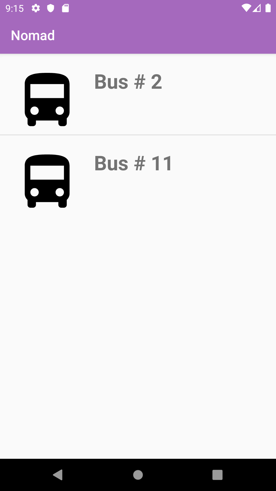
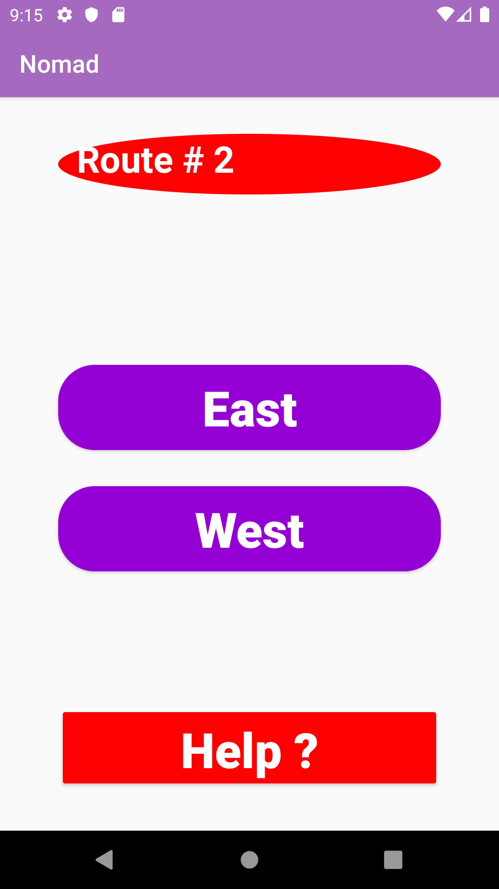
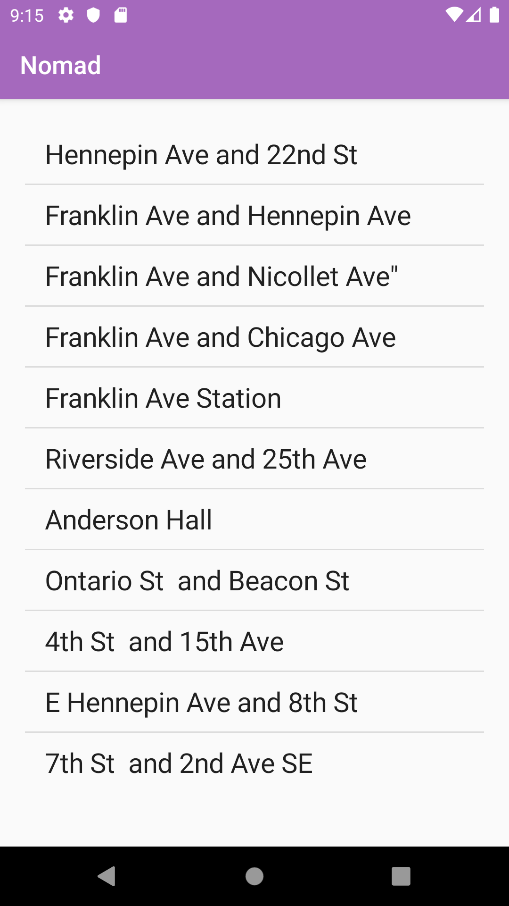

# Nomad -> Metro Transit Acceible Bus Android App

## To clone this project, use this command.

> git clone https://github.com/Ayanle99/Nomad.git

## Some screenshots

  
   
  

## Add Jsoup dependency to your gradle
> compile 'org.jsoup:jsoup:1.12.1'

